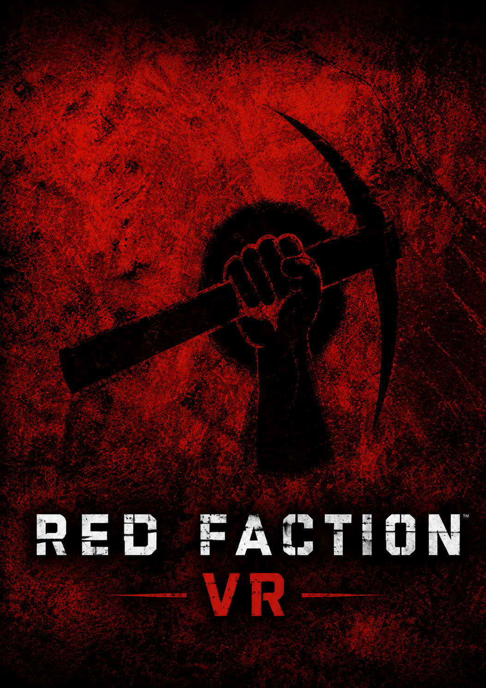
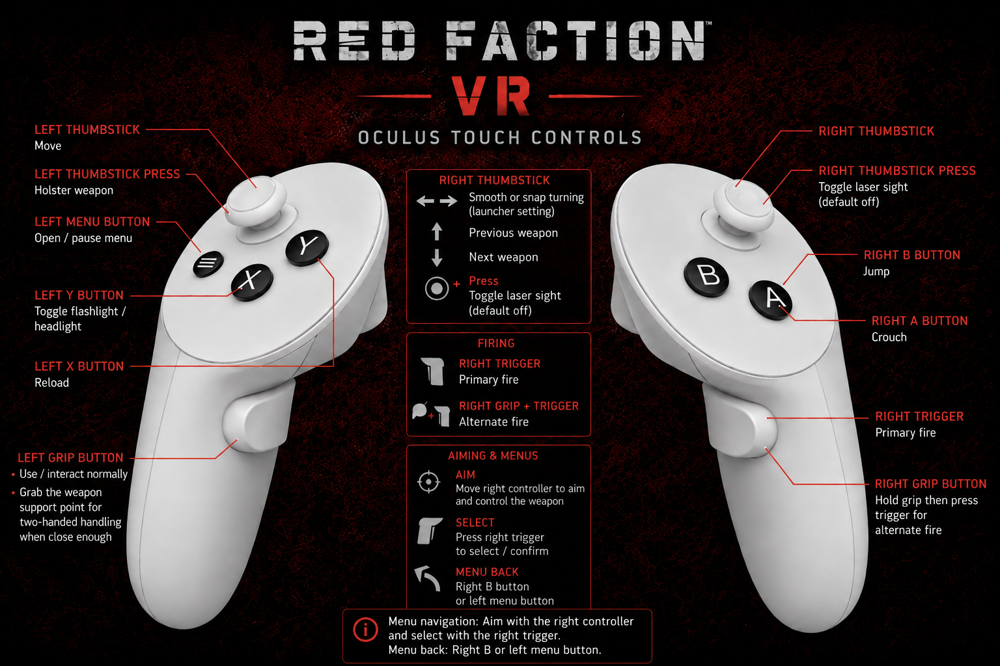
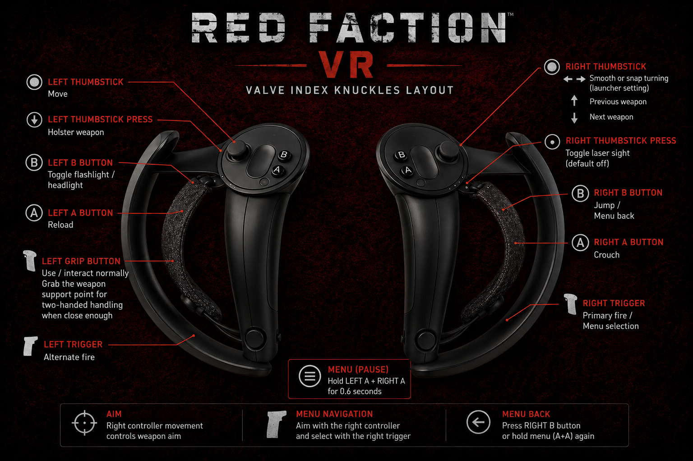

<p align="center">
  
</p>

# Alpine Faction VR

Alpine Faction VR 1.0 beta is a tested virtual-reality implementation for the 2001 FPS **Red Faction**, built on top of [Alpine Faction](https://github.com/GooberRF/alpinefaction).

> [!CAUTION]
> This is a beta VR release and may still crash or cause visual, input, or gameplay issues on some systems. Back up your files and saves before trying it.

The current release is **Alpine Faction VR 1.0 beta**.

## What's new in 1.0 beta

- The bomb-defusal sequence and ending credits are now presented correctly in VR.
- The bomb-defusal interface supports left-thumbstick directional input.
- Menus and native weapon scopes remain fixed in tracking space until recentering, making them more comfortable to use.
- New save games receive an automatic date-and-time name.
- Shake to reload is enabled by default with an adjustable 80 cm/s downward-motion threshold.
- The laser sight is thinner, and weapon-fire position and direction remain synchronized with the visible laser.
- The required bundled `VR` mod is selected automatically and is included in both release packages.

## Current scope

The project adds an optional OpenXR path to Alpine Faction's Direct3D 11 renderer, including stereoscopic rendering, headset tracking, VR-oriented camera and weapon handling, and configurable snap or smooth turning. Singleplayer is the primary target. Client multiplayer is available on a best-effort, unsupported basis; dedicated-server VR is not supported.

An active OpenXR runtime and a working PC VR setup are required. VR mode forces the Direct3D 11 renderer.

## Installation

1. Install a legitimate copy of **Red Faction**.
2. Download the latest installer from this repository's [Releases](https://github.com/CactusVRStudios/alpinefactionVR/releases) page and run it. It locates Red Faction, updates supported retail/digital versions when needed, creates the required directories, and installs Alpine Faction VR in one pass.
3. Start `AlpineFactionVR.exe`. **VR / OpenXR is enabled by default**; open **Options** if you want to change the turn mode or other VR settings.
4. Make sure your headset's OpenXR runtime is active, then launch the game.

The launcher automatically selects the bundled `VR` mod while VR mode is enabled.

An advanced/manual ZIP containing only the mod files is provided with every release. It requires an already prepared Alpine Faction installation; extract it over the Alpine Faction directory and replace files when prompted.

You can also enable VR with the `-vr` command-line option. Settings are stored in `alpine_settings.ini`.

## Default VR controller mapping

<p align="center">
  
</p>
<p align="center">
  
</p>

### Oculus Touch controls

- **Left thumbstick:** Move
- **Ladders:** Look up/down and push the left thumbstick forward to climb
- **Swimming:** Look up/down and push the left thumbstick forward to swim vertically
- **Left thumbstick press:** Holster weapon
- **Left X:** Reload
- **Shake to reload:** Optional; when enabled, make one forceful downward shake with the right controller
- **Left Y:** Toggle flashlight/headlight
- **Flashlight direction:** Follows the tracked HMD view direction
- **Left grip:**
  - Use/interact normally
  - Grab the weapon support point for two-handed handling when close enough
- **Left menu button:** Open/pause menu when using a native non-SteamVR OpenXR runtime
- **SteamVR menu:** Hold left X and right A together for 0.6 seconds
- **Right thumbstick left/right:** Smooth or snap turning, depending on launcher setting
- **Right thumbstick up:** Cycle to the previous weapon
- **Right thumbstick down:** Cycle to the next weapon
- **Fast weapon switch:** Optional launcher checkbox for instant cycling; off by default so the native selector remains available for weapons such as remote charges
- **Right thumbstick press:** Toggle laser sight; default is off
- **Right A:** Crouch
- **Right B:** Jump
- **Right trigger:** Primary fire
- **Right grip, then right trigger:** Alternate fire
- **Right controller movement:** Aim and control the weapon
- **Menu navigation:** Aim with the right controller and select with the right trigger
- **Menu back:** Right B, the left menu button on a native runtime, or the SteamVR button chord

### Valve Index Knuckles controls

- **Left thumbstick:** Move
- **Ladders:** Look up/down and push the left thumbstick forward to climb
- **Swimming:** Look up/down and push the left thumbstick forward to swim vertically
- **Left thumbstick press:** Holster weapon
- **Left A:** Reload
- **Shake to reload:** Optional; when enabled, make one forceful downward shake with the right controller
- **Left B:** Toggle flashlight/headlight
- **Flashlight direction:** Follows the tracked HMD view direction
- **Left squeeze/grip:**
  - Use/interact normally
  - Grab the weapon support point for two-handed handling when close enough
- **SteamVR menu:** Hold left A and right A together for 0.6 seconds
- **Right thumbstick left/right:** Smooth or snap turning, depending on launcher setting
- **Right thumbstick up:** Cycle to the previous weapon
- **Right thumbstick down:** Cycle to the next weapon
- **Fast weapon switch:** Optional launcher checkbox for instant cycling; off by default so the native selector remains available for weapons such as remote charges
- **Right thumbstick press:** Toggle laser sight; default is off
- **Right A:** Crouch
- **Right B:** Jump
- **Right trigger:** Primary fire
- **Left trigger:** Alternate fire
- **Right controller movement:** Aim and control the weapon
- **Menu navigation:** Aim with the right controller and select with the right trigger
- **Menu back:** Right B or hold both A buttons for 0.6 seconds

Shake to reload is enabled by default with an 80 cm/s threshold. It can be disabled or adjusted freely in the launcher under **Options → VR / OpenXR**. Lower threshold values are more sensitive.

### Turrets and vehicles

- **Mounted turret / jeep gunner aim:** Move your head; the turret follows HMD yaw and pitch
- **Vehicle movement / throttle:** Left thumbstick, relative to the vehicle rather than head direction
- **Vehicle steering / pitch:** Right thumbstick
- **Fire / alternate fire:** Touch uses right trigger / right grip plus right trigger; Index uses right trigger / left trigger
- **Enter or exit:** Left grip (Use)
- **Flashlight / vehicle headlight:** Left Y on Touch or left B on Index
- Weapon cycling is suspended while mounted so right-stick pitch remains available to vehicles.
- Exiting a pitched vehicle such as the submarine clears residual vehicle pitch/roll while preserving the player's heading, keeping the on-foot horizon level.

### Precision and sniper scopes

- Alternate fire retains Red Faction's native zoom, reticle, and scope mask for the Precision Rifle and Sniper Rifle.
- While zoomed, the completed native game image is presented on an OpenXR quad that remains fixed in tracking space until the scope closes or tracking is recentered.
- Closing the scope, switching weapons, opening a menu, or leaving gameplay immediately restores normal stereoscopic VR.

### Menus and interaction

- Usable objects—including buttons, switches, doors, and vehicles—follow the physical HMD viewing direction.
- Interaction overlays and activation use the same target.
- Main, pause, and shared VR menus open upright in front of the player and remain fixed in tracking space until recentering.
- Controller menu raycasting uses the currently displayed menu pose.
- The bomb-defusal sequence and ending credits use the same VR-compatible quad presentation; the bomb interface accepts left-thumbstick directions.

### Room-scale movement

- Physical HMD movement uses Red Faction's native swept-sphere world collision with a 16 cm head volume, including ordinary walls, invisible collision faces, and mover geometry.
- When room-scale movement reaches a wall, the complete tracked rig—both eyes, hands, weapon, muzzle, and laser—is pushed back to the last safe position.
- Smooth and snap turns pivot around the HMD's current physical room position. Walking away from the last calibration point no longer makes thumbstick turning orbit that old center.
- Turrets and vehicles keep their mounted movement rules and do not receive the on-foot room-scale collision correction.
- Opening or closing a VR menu automatically recalibrates tracking yaw, physical height, and the room-scale origin from the current HMD pose.
- Headset-runtime recentering, including the Meta-button hold gesture, preserves the current game-space heading and tracked rig alignment instead of snapping back to native body yaw.
- Buttons, switches, doors, vehicles, and other Use targets follow the HMD view direction. The interaction overlay and the actual activation query use the same tracked target.

## Removing the VR build

Reinstall the regular Alpine Faction release to restore its original files.

## Building from source

This project builds for Win32 with Visual Studio and CMake. Configure with OpenXR enabled, then build the Release configuration:

```powershell
cmake -S . -B build-afvr -G "Visual Studio 17 2022" -A Win32 -DAF_ENABLE_OPENXR=ON
cmake --build build-afvr --config Release
```

The pinned Khronos OpenXR SDK is fetched during configuration, and the 32-bit loader is linked statically. See [docs/BUILDING.md](docs/BUILDING.md) for more information.

## Creating release packages

After building the OpenXR-enabled Release configuration, create both supported release artifacts with:

```powershell
.\tools\make-vr-release.ps1 -Version "1.0beta" -BuildDir ".\build-afvr\bin\Release"
```

The script always creates a basic ZIP and, when Inno Setup 6 and the patch payload in `setup/patches/output` are available, a one-step installer. Use `-SkipInstaller` when only the ZIP is needed.

## Credits and license

All credit for Alpine Faction goes to the **Alpine Faction development team**. This experimental VR work would not exist without their extensive Red Faction patch and the projects on which it is based.

Alpine Faction is a fork of [Dash Faction](https://github.com/rafalh/dashfaction). Source code is licensed under the Mozilla Public License 2.0; see [LICENSE.txt](LICENSE.txt) and [resources/licensing-info.txt](resources/licensing-info.txt) for full licensing and contributor information.
